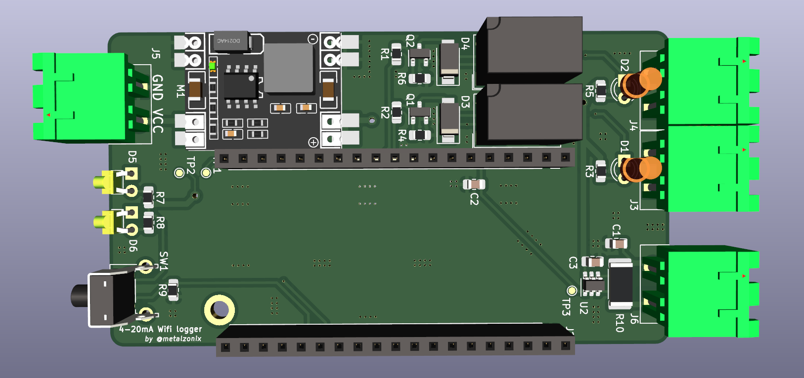
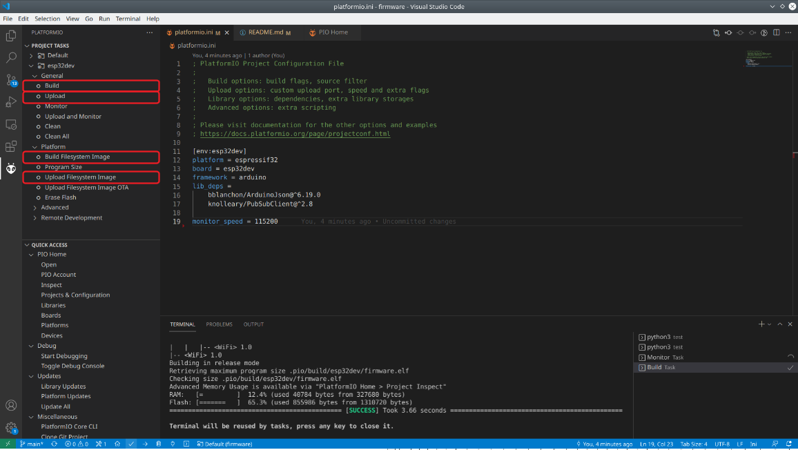
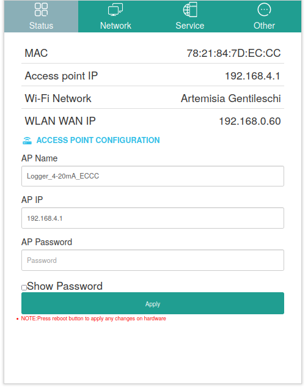
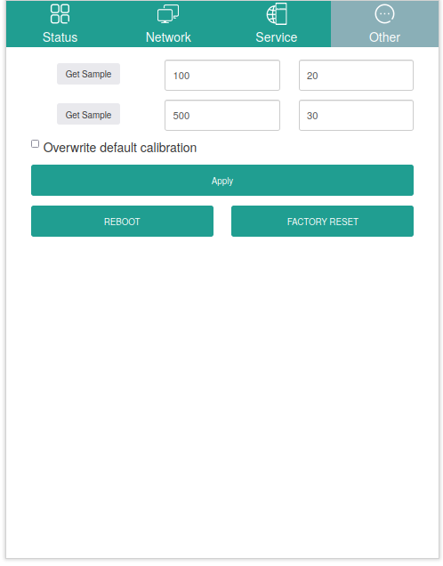
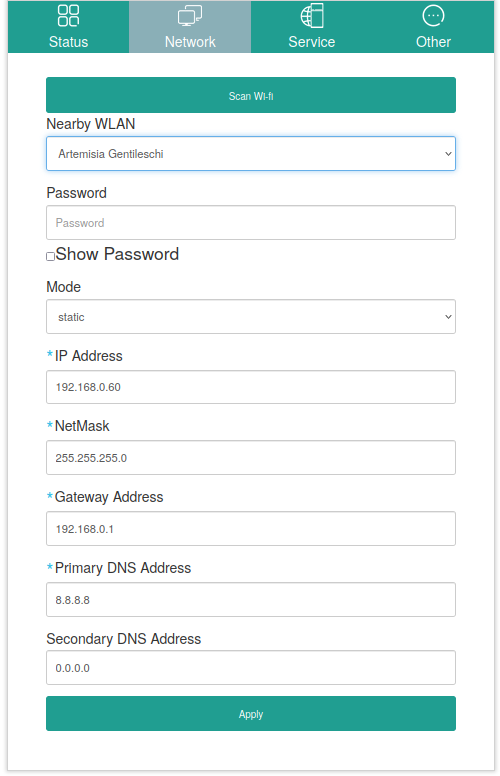
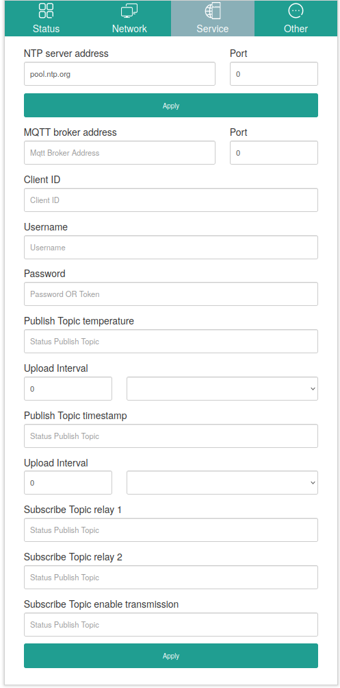

# 4-20ma-wifi-bridge




## Features
### Hardware
 * 5-24v Power supply.
 * 1 Input 4-20 mA.
 * 2 Relays to control loads up to 1A at 24DVC or 0.5A at 125VAC.
 * WIFI 802.11 b/g/n (2.4 GHz), up to 150 Mbps.


## Get the source code
Download repository and update submodules:

```
$ git clone https://github.com/AngelJMC/4-20ma-wifi-bridge.git
```


### Directory Structure

    .
    ├── docs          # Documentation files
    ├── firmware      # FW source code (Visual Studio Code)
    ├── hardware      # HW design files (Kicad)

## Firmware

If you want to modify the source code or program your devices, it is highly recommended to use Visual Studio Code and the Platformio plugin. Just open the "firmware" directory with Visual Studio Code and the whole project will be ready for use.

### Load firmware 

 1. Build and Upload Filesystem Image.
 2. Build and Upload program code.



## Configuration Process

 1. Build and Upload Filesystem Image to your ESP32
 2. Build and Upload program code.
 3. Connect mobile or PC with hotspot: Logger_4-20mA_XXXX. Password: Kmf5cyJUWw
 4. Go to web browser and hit 192.168.4.1. Use the credential supervisor/fEVcCQxig to enter.
 5. Go to Network section and scan for your wifi network, write password and static network configuration if you want, hit apply.
 6. Go to Service section give necessary server credential for MQTT and set the pub/sub topic names.
 7. Go to Other section if you need calibrate the 4-20mA acquisition electronic.


## Configuration Web





## Library Used

* ESp32_arduino :- https://github.com/espressif/arduino-esp32
* ESPAsyncWebServer:- https://github.com/me-no-dev/ESPAsyncWebServer
* AsyncTCP:- https://github.com/me-no-dev/AsyncTCP
* esp32 SPIFF File system :- https://github.com/me-no-dev/arduino-esp32fs-plugin

The configuration web page is based on the work of @futechiot https://github.com/futechiot/Configuration-webpage-esp32
